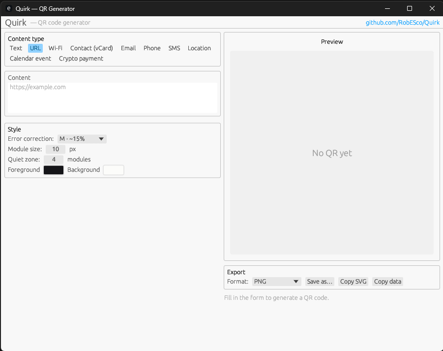

# Quirk

> A rich, cross-platform QR code generator built with Rust and [`egui`](https://github.com/emilk/egui).

Quirk is a single-window native app that turns anything from a plain URL to a Wi-Fi
handshake, a vCard, a calendar event, or a Bitcoin payment URI into a clean,
exportable QR code — fully parameterizable, fully offline, fully local.



## Features

- **10 content types** — text, URL, Wi-Fi (WPA / WEP / open, hidden flag),
  vCard 3.0 contact, mailto with subject/body, tel, SMS, geo location,
  vCalendar event, crypto payment URI (BTC / ETH).
- **Live preview** that re-renders on every keystroke.
- **Customizable style** — error correction level (L / M / Q / H), module size
  in pixels, quiet-zone width, foreground and background colors.
- **Two export formats** — raster PNG and vector SVG, plus "copy SVG / copy
  data" shortcuts to the clipboard.
- **Small binary** — `lto = "thin"` + `strip = true` + `panic = "abort"` keep
  release builds under 10 MB on Linux.

## Building locally

You need the [Rust toolchain](https://rustup.rs/) (1.75+).

```bash
cargo run --release
```

A window titled "Quirk" will open.

## Releases

Tagged commits (`v*`) trigger the release workflow, which builds native binaries
for:

| OS      | Targets                                      |
| ------- | -------------------------------------------- |
| Linux   | `x86_64-unknown-linux-gnu`                   |
| macOS   | `x86_64-apple-darwin`, `aarch64-apple-darwin` |
| Windows | `x86_64-pc-windows-msvc`                     |

Each artifact is uploaded to the matching GitHub Release as `quirk-<version>-<target>.<ext>`.

## Project layout

```
src/
  main.rs       entry point, eframe wiring
  app.rs        app state, preview regeneration, PNG/SVG export
  qr_types.rs   payload builders for every content type (with unit tests)
  ui.rs         egui panels: type selector, dynamic form, preview, controls
.github/
  workflows/
    ci.yml      check, test, build on every push / PR
    release.yml cross-platform release artifacts on `v*` tags
```

## Testing

```bash
cargo test
```

The payload builders in `qr_types.rs` are unit-tested for URL handling, Wi-Fi
escaping, vCard minimum fields, crypto URI shape, and date-stripping for
all-day events.

## License

Dual-licensed under either of:

- Apache License, Version 2.0
- MIT License

at your option.